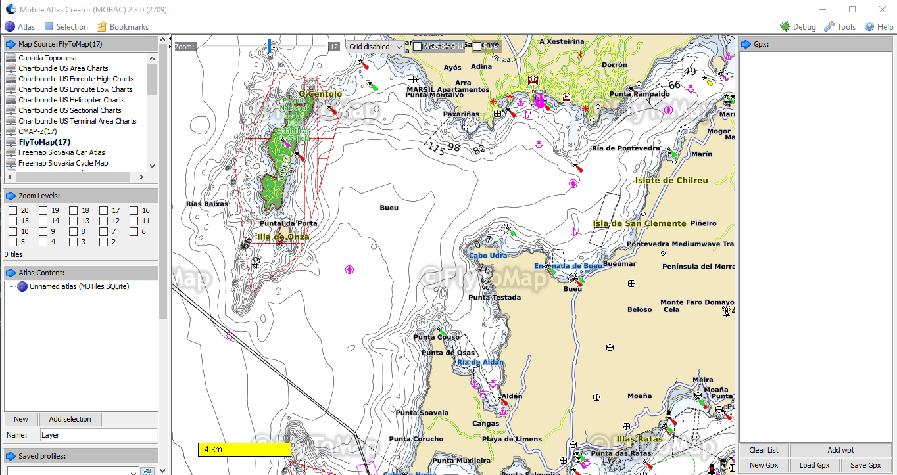

# MARINE MOBAC MAPTILES:

Download [MOBAC](https://sourceforge.net/projects/mobac/files/latest/download) 

Download [JAVA](https://adoptium.net/es/?variant=openjdk11&jvmVariant=hotspot)

Place [Maptiles](/mapsources) files on "Mapsources" folder.

Open MOBAC and make your .mbtiles charts!!

